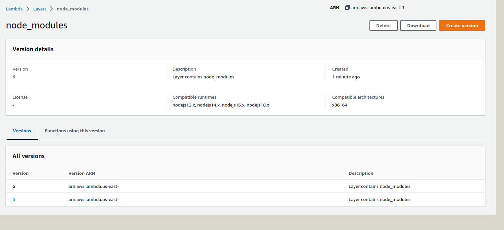

# Manage Lambda Layers with NPM Dependencies
This repository creates [Lambda Layers](https://docs.aws.amazon.com/lambda/latest/dg/configuration-layers.html) with NPM dependencies on the AWS cloud.

It uses a GitHub action to build and deploy the layer.

## How to use
1. Fork this repository
2. Create IAM user [access keys](https://docs.aws.amazon.com/IAM/latest/UserGuide/id_credentials_access-keys.html#Using_CreateAccessKey)
3. Set AWS_ACCESS_KEY_ID & AWS_SECRET_ACCESS_KEY secrets on repository settings
4. Edit the variable NPM_PACKAGES in the [action specification](.github/workflows/lambda-layer-creator.yml) according to need
5. As soon as push this change, the workflow will run and deploy the layer to  AWS account

